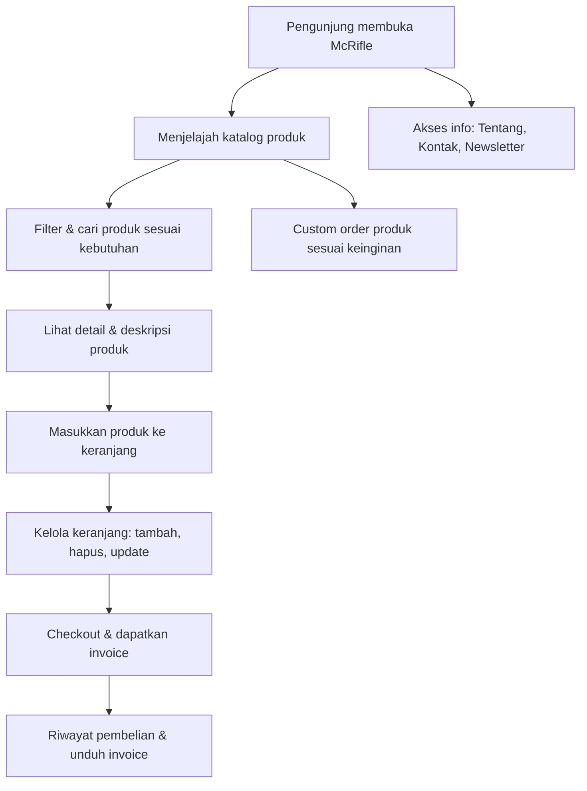

# 🚀 McRifle - Solusi Katalog & Penjualan Senjata Replika Modern

Selamat datang di **McRifle**! Website katalog dan penjualan senjata replika, aksesoris, serta layanan custom order yang dirancang modern, mudah digunakan, dan responsif. Cocok untuk kolektor, penghobi, maupun penjual!

---

## 🎯 Apa itu McRifle?
McRifle adalah platform digital berbasis Laravel yang memudahkan Anda:
- Menjelajah berbagai produk senjata replika & aksesoris
- Melakukan pemesanan custom sesuai keinginan
- Mengelola keranjang belanja & riwayat transaksi
- Mendapatkan invoice otomatis & download PDF

---

## 🌟 Fitur Unggulan
- **Katalog Produk Lengkap**: Filter kategori, harga, dan pencarian cepat
- **Keranjang Pintar**: Tambah, hapus, update produk dengan mudah
- **Checkout & Invoice Otomatis**: Proses pembelian cepat, invoice langsung tersedia
- **Custom Order**: Buat permintaan produk sesuai spesifikasi Anda
- **Manajemen Admin**: Kelola produk, kategori, dan pesanan (khusus admin)
- **Autentikasi Aman**: Login user & admin terpisah
- **UI Modern & Responsif**: Nyaman di desktop maupun mobile

---

## 🛠️ Teknologi
- **Laravel** (Backend & Routing)
- **Blade** (Template Engine)
- **Tailwind CSS** (Styling)
- **DomPDF** (Export Invoice PDF)
- **Session-based Cart**

---

## 🚦 Cara Pakai (Instalasi Cepat)
1. Clone repo: `git clone https://github.com/USERNAME/McRifle.git`
2. Install dependency: `composer install` & `npm install`
3. Build asset: `npm run build`
4. Copy & edit `.env`, generate key: `php artisan key:generate`
5. Atur database di `.env`, lalu migrasi: `php artisan migrate`
6. Jalankan: `php artisan serve` → buka di browser

---

## 🔎 Alur Penggunaan (Flowchart)

---

## 👤 Tim & Kontribusi
Dikembangkan oleh [Muhammad Chaska Syahdiladarama].
Kontribusi, saran, dan pull request sangat terbuka!

---

> **McRifle** – Belanja replika senjata & aksesoris jadi lebih mudah, aman, dan menyenangkan!
